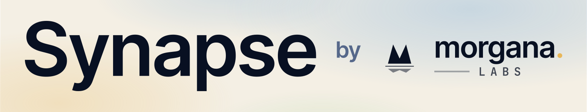

<a href="https://libmorgana.com/synapse"></a>

# synapse-driven-development

A Claude Code / agent skill for **Synapse-Driven Development (SDD)**: author the cross-function
invariant first, prove it with a point-mutation-checked test, and register it in Synapse as a
durable constraint that re-surfaces to the next editor.

The methodology itself is embedded in the `synapse_cli` binary (`synapse_cli guide`), so this skill
stays thin: `SKILL.md` covers only how to get the tool running (install, version check, license,
invocation) and defers the method to `guide`. The binary is the single source of truth for the
method; the skill cannot drift from it.

> **Make SDD your default.** Installing the skill lets the agent *route* to SDD; it does not make
> SDD the default way you build. To adopt it as your standard practice, add a line to your global
> agent instructions (`~/.claude/CLAUDE.md`, `AGENTS.md`, `GEMINI.md`, etc.) — e.g. *"For feature
> development and bug fixes, use the `synapse-driven-development` skill (invariant-first, then a
> mutation-proven test) by default; fall back to plain TDD only when `synapse_cli` isn't
> available."* That instruction, not the skill's presence, is what makes every task start with SDD.

- **The tool:** `synapse_cli` - invariant store, drift + proof gates, context retrieval, embedded
  guide. Installed at `~/.synapse/bin/synapse_cli`. Requires a `synapse.license` file.
- **Releases:** a signed, notarized, and stapled macOS `.pkg` plus an `install.sh` are published on
  this repo's [GitHub releases](https://github.com/morgana-labs/synapse-driven-development/releases).
  The skill checks the installed version against the latest release and, on request, runs the
  official installer.
- **Derived from** the original invariant-driven-development skill, slimmed once the methodology
  moved into the binary.

## Does it work?

A **single-edit trap** benchmark measures the exact failure SDD targets: an agent asked to make one
change completes it and passes the tests, but silently breaks a **hidden cross-function invariant**
the edit should have preserved. `both-green` = the change works **and** that invariant is still
intact. Across **301 runs (0 errors)**:

| Condition | both-green | 95% CI | $/run |
|---|---:|---:|---:|
| haiku alone | 38% | [15%, 61%] | $0.041 |
| **haiku + Synapse** | **98%** | [95%, 100%] | $0.048 |
| opus alone | 65% | [43%, 85%] | $0.205 |
| **opus + Synapse** | **100%** | [100%, 100%] | $0.333 |

Synapse lifts Haiku **38% → 98%** and Opus **65% → 100%** for a few cents more per run. The
"invariant preserved" rate was *identical* to `both-green` in every condition — so **every failure
without Synapse was a silent invariant break**, not a broken change: the "looks done, passes tests,
quietly wrong" degradation the invariant graph re-surfaces before the edit lands. Notably, a
Synapse-guided Haiku (98% at $0.048) beats an unguided Opus (65% at $0.205) at **under a quarter the
cost** — the invariant layer buys more quality than a model-tier upgrade does.

## Installation

A skill is a directory containing `SKILL.md`. The agent auto-discovers it once it lives in a
`skills/` location the agent scans. Use the [`skills`](https://skills.sh) CLI to install it there
from this repo — no manual cloning or path juggling.

### With the `skills` CLI (recommended)

```bash
# Global — available across all your projects
npx skills add -g morgana-labs/synapse-driven-development

# Project scope — committed with the current repo, shared with your team
npx skills add morgana-labs/synapse-driven-development
```

Verify and manage:

```bash
npx skills list        # confirm synapse-driven-development is installed
npx skills remove morgana-labs/synapse-driven-development
```

Re-running `npx skills add` updates to the latest commit.

### Manual (editable dev copy)

To hack on the skill itself, clone it and drop it into a skills directory the agent scans
(e.g. `~/.claude/skills/` for global, or `<repo>/.claude/skills/` for a project). The directory name
must match the skill's `name` (`synapse-driven-development`):

```bash
git clone https://github.com/morgana-labs/synapse-driven-development.git ~/src/sdd
ln -s ~/src/sdd ~/.claude/skills/synapse-driven-development
```

### Activation

The skill activates from its `description`: the agent routes to it automatically when the work
involves invariants, SDD/IDD, mutation testing, porting against a reference, or Synapse. No slash
command or manual trigger is required.

## First run

The skill ships only `SKILL.md` — **not** the `synapse_cli` binary. On first use it will:

1. Compare the installed `~/.synapse/bin/synapse_cli` against the latest GitHub release. If the
   binary is missing or out of date, it asks before installing, then runs the official installer:
   `curl -fsSL https://github.com/morgana-labs/synapse-driven-development/releases/latest/download/install.sh | sh`
   The installer downloads the signed + notarized + stapled macOS `.pkg`, verifies its checksum, and
   installs it to `~/.synapse/bin` with `installer -target CurrentUserHomeDirectory` — **no sudo**.
   Because the `.pkg` staples its notarization ticket, the binary lands non-quarantined and launches
   with no online Gatekeeper check (a bare binary would force an online check that can hang).
2. Require a valid `synapse.license` file (searched: `$SYNAPSE_LICENSE_FILE`, `./synapse.license`,
   `<git-root>/synapse.license`, `~/.synapse/synapse.license`). `synapse_cli doctor` reports which
   file it loaded and whether it is valid.

From there, the method is `synapse_cli guide`. See `SKILL.md` for the full session flow.

## Onboarding a repo

Point Synapse at an existing repo, protect the risky code first, then let it seed the rest:

1. **`synapse_cli doctor`** — confirm the binary runs and the license is valid.
2. **`synapse_cli onboard --confirm`** — set up the constraint store (run once).
3. **`synapse_cli scan --exclude examples,benches,tests`** — a cold risk map of the top defect-prone
   files × their cross-file seams × the failure paths inside them. (`--exclude`, or `scan_exclude:`
   in `docs/syn/config.yml`, keeps non-shipping code out of the churn ranking.)
4. **`synapse_cli hotspots --exclude examples,benches,tests`** — the uncovered, high-churn files to
   protect first; **`synapse_cli suggest-members <file>`** turns each into a pick-list of symbols.
5. **Author the deep invariants by hand** on those hotspots — name the property, prove it with a
   mutation-checked test (`synapse_cli prove …`), and `synapse_cli sync`. This is the judgment part.
6. **`synapse_cli seed`** — *after* step 5, auto-registers the remaining directed candidate
   invariants (bounds, error-path, cross-seam, throws) as unproven, at zero model cost. Then
   `synapse_cli check` and prove or delete each.

The ordering matters: `seed` runs **after** the hand-authored hotspot invariants, not before — on a
fresh repo the gap engine has nothing to anchor to until you've tracked the code that matters. Run
`synapse_cli guide` for the full method.

## Architecture — what's in the binary

`synapse_cli` is one self-contained binary. Everything runs in-process: no daemon, no database to
stand up, and zero footprint in your repo (`synapse_cli doctor` shows where the store actually
lives).

**Tacitus — the embedded store and engine.** Synapse's system of record is [Tacitus](https://www.libmorgana.com),
morgana labs' embedded data engine, compiled straight into the CLI (`embedded Tacitus, in-process`):

- **Write-ahead log** — an append-only, per-tenant-encrypted log the invariants live in. It is
  bi-temporal, so the store's own history is queryable with git-shaped verbs (`synapse_cli log`,
  `synapse_cli diff <A> <B>`). The store is keyed to project identity, so it survives a folder move
  or a re-clone.
- **Relational + graph/vector** — a dynamic relational catalog holds the flows, members, proofs,
  edges, and gaps, alongside an HNSW vector index for similarity and graph retrieval. This is the
  relational-and-graphing layer the invariant model is built on.
- **Context retrieval** — the engine behind `synapse_cli context`: given a file, it returns the
  invariants, mutates, assumes, and edge position that govern it — the constraints a diff must
  respect that aren't visible in the source.

**The invariant logic — the SDD engine on top of the store:**

- **Model** — invariants attach to tracked *symbols* (members) grouped into *flows*, each backed by
  a proof at one of four strengths: a type-level guarantee, a point-mutation-checked test, a
  simulation harness, or a named manual gate.
- **Drift + proof gate** (`synapse_cli check`) — hashes tracked members and re-runs the recorded
  mutation proofs, so a changed symbol or a proof that stopped reddening blocks the commit.
- **Gap engine** (`synapse_cli gap-analysis`) — sweeps the invariant graph for confirmed gaps
  (coverage, cross-seam, coupling-seam, resource-seam, dependency, dangling, throw), each carrying a
  candidate invariant and the mutation that would prove it. `hotspots` and `coupling` rank *where*
  to look, from git churn and temporal co-change.

**Axon — the cloud brain and orchestrator (paid, optional).** With a paid license the local store
becomes a cache in front of [Axon](https://www.libmorgana.com), morgana labs' cloud brain and
orchestrator — the authoritative copy a team shares. Writes dual-write to cache and brain and replay
exactly-once after any offline period, and `synapse_cli deltas` / `watch` surface teammates' new
invariants and cross-seam heads-ups live while you edit. The free tier is fully local and offline.

> **Sibling products.** Tacitus and [HyperStack](https://www.libmorgana.com) (a single-binary
> Supabase alternative — auto-generated Data API, Auth, RLS, Realtime, Storage, Edge Functions on
> Postgres) are separate morgana labs products. `synapse_cli` embeds **Tacitus**; it does not
> include HyperStack.
